# AWS.Chatbot Chatbot - Mermaid Diagrams

## 1. System Architecture Diagram

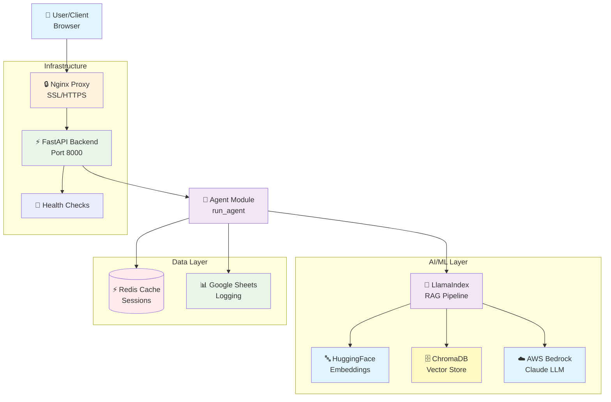

## 2. RAG Pipeline Flow

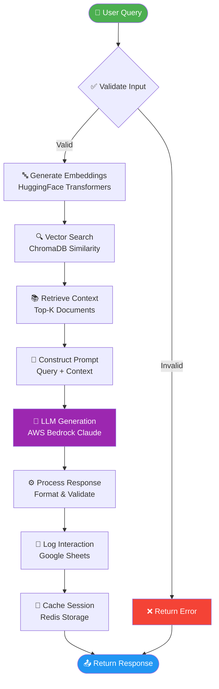

## 3. Data Flow Architecture

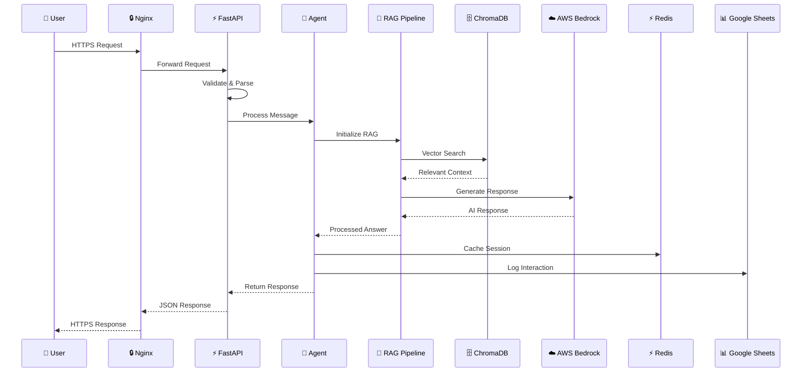

## 4. Component Relationship Diagram

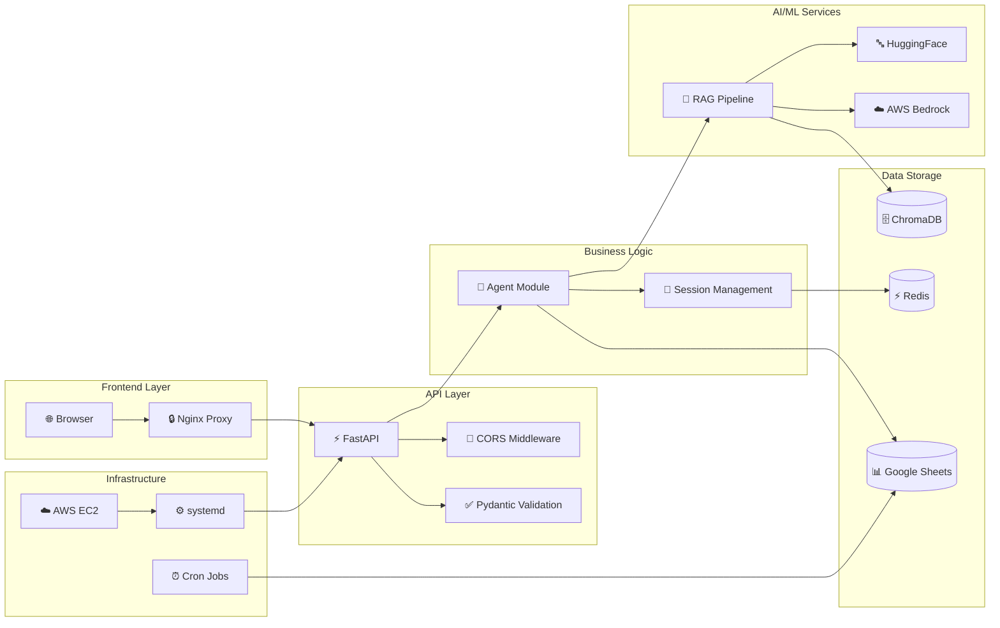

## 5. Technology Stack Diagram

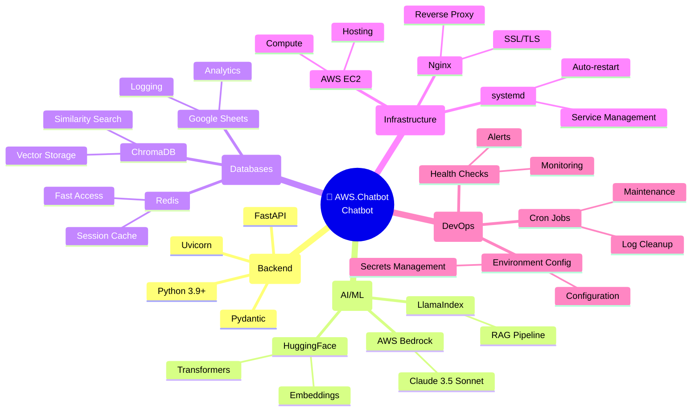

## 6. API Endpoints Overview

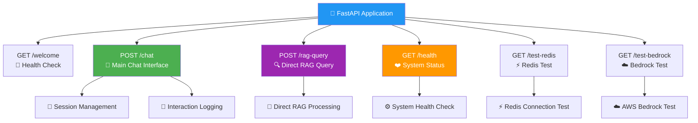

## 7. Security & Compliance Flow

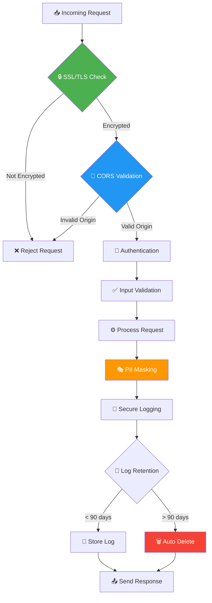

## 8. Sistem Mimarisi Diagramı (Graph TB)

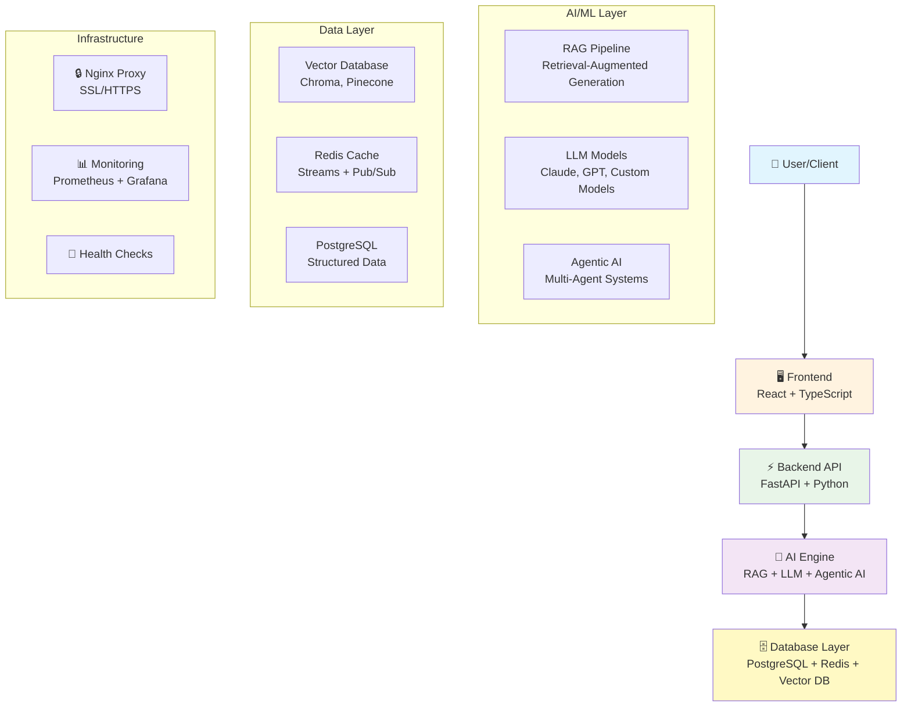

## 9. Sequence Diagram (Zaman Akışı)

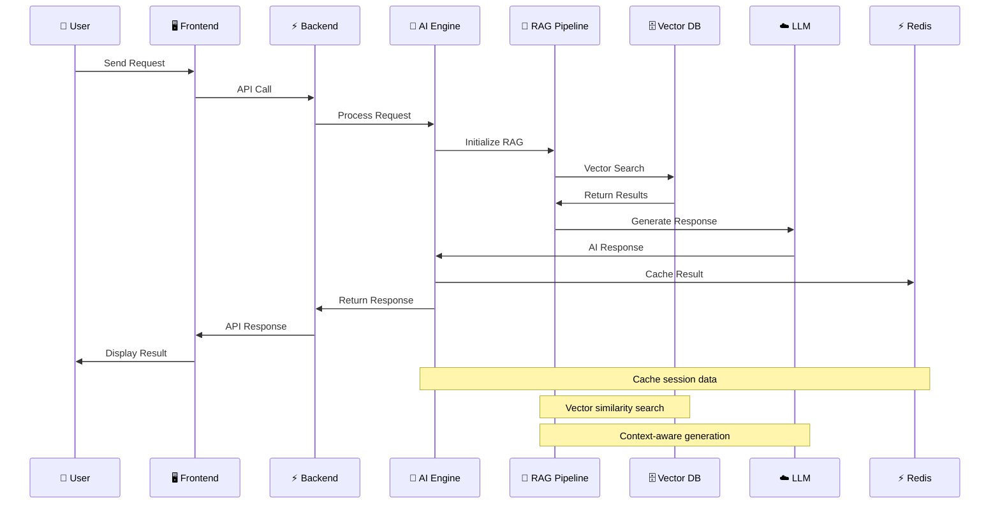

## 10. Mind Map (Zihin Haritası)

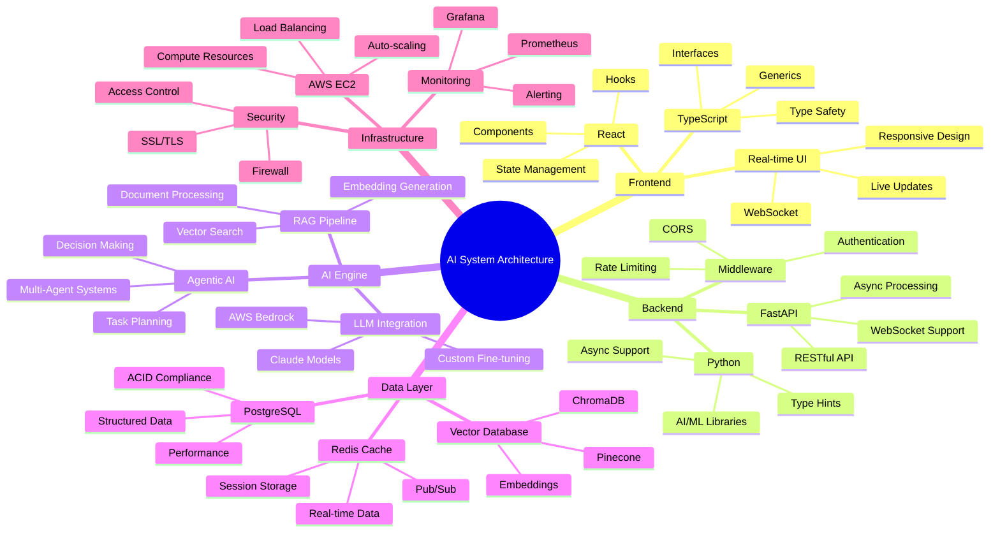

## 11. Gantt Chart (Proje Zaman Çizelgesi)

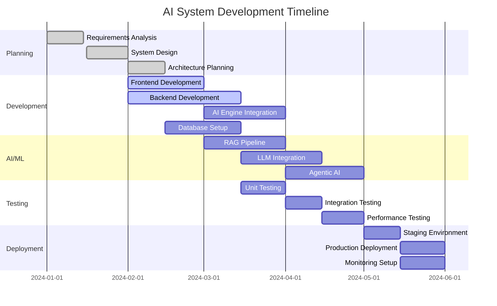

## 12. Pie Chart (Pasta Grafik)

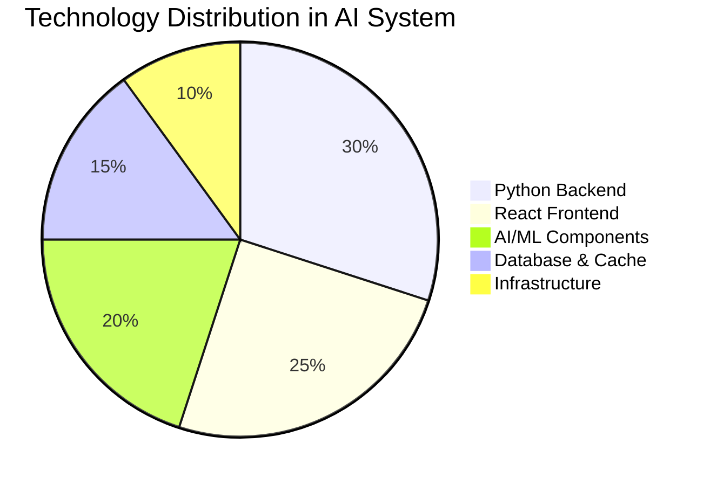

## 13. Pie Chart - AI Components Breakdown

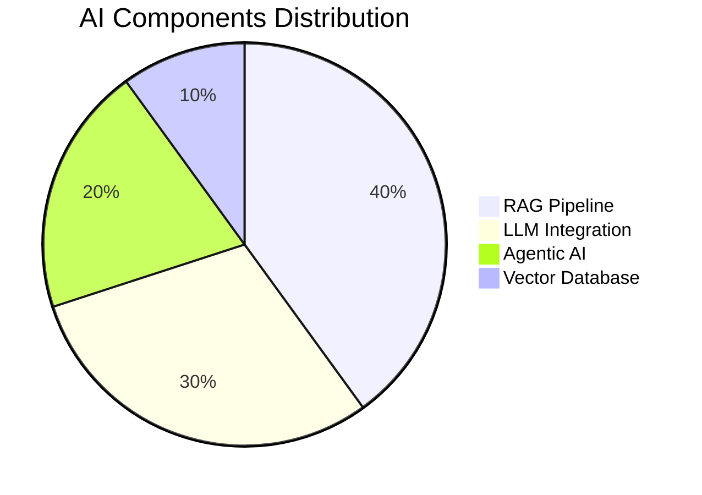

## 14. Pie Chart - Development Effort

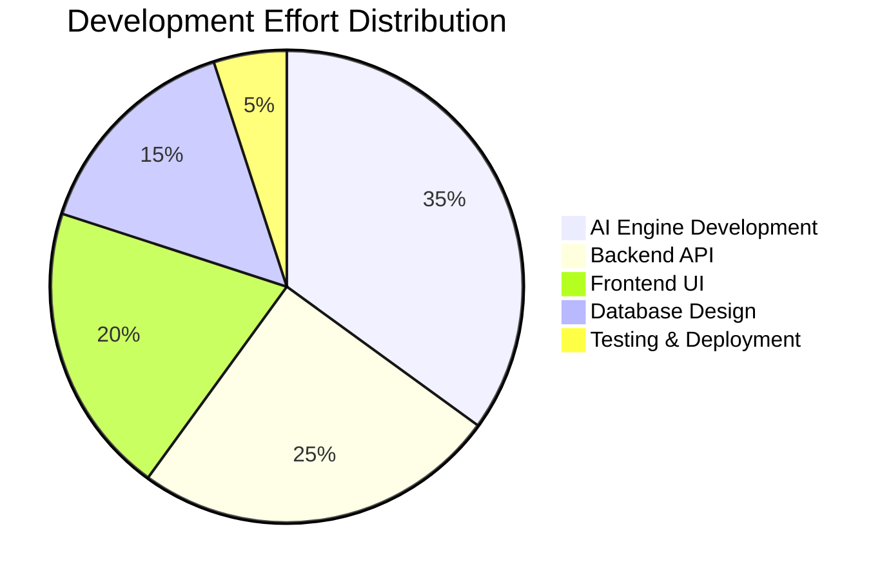

## Mermaid Diagramlarını Kullanma

### 1. GitHub/GitLab'da
- Markdown dosyalarında doğrudan render edilir
- README.md'ye ekleyebilirsin

### 2. Mermaid Live Editor
- https://mermaid.live/ adresinde test edebilirsin
- PNG/SVG olarak export edebilirsin

### 3. VS Code'da
- Mermaid Preview extension kullan
- Canlı önizleme yapabilirsin

### 4. Portfolio'da Kullanım
- PNG olarak export et
- HTML sayfalarında embed et
- Interaktif olarak kullan

### 5. Yeni Eklenen Diagram Türleri
- **Sistem Mimarisi Diagramı:** Genel sistem yapısı
- **Sequence Diagram:** Zaman bazlı işlem akışı
- **Mind Map:** Detaylı teknoloji haritası
- **Gantt Chart:** Proje zaman çizelgesi
- **Pie Chart:** Teknoloji dağılımı ve çaba analizi

Bu diagramlar projenin karmaşıklığını ve teknik derinliğini çok güzel gösteriyor! Hangi diagramı öncelikli olarak kullanmak istiyorsun?