# AWS.Chatbot Chatbot - Mermaid Diagrams

## 1. System Architecture Diagram

```mermaid
graph TB
    User[👤 User/Client<br/>Browser] --> Nginx[🔒 Nginx Proxy<br/>SSL/HTTPS]
    Nginx --> FastAPI[⚡ FastAPI Backend<br/>Port 8000]
    
    FastAPI --> Agent[🤖 Agent Module<br/>run_agent]
    Agent --> RAG[🧠 LlamaIndex<br/>RAG Pipeline]
    
    RAG --> Embed[🔤 HuggingFace<br/>Embeddings]
    RAG --> Vector[🗄️ ChromaDB<br/>Vector Store]
    RAG --> LLM[☁️ AWS Bedrock<br/>Claude LLM]
    
    Agent --> Redis[(⚡ Redis Cache<br/>Sessions)]
    Agent --> Sheets[📊 Google Sheets<br/>Logging]
    
    FastAPI --> Health[💚 Health Checks]
    
    subgraph "AI/ML Layer"
        Embed
        Vector
        LLM
        RAG
    end
    
    subgraph "Data Layer"
        Redis
        Vector
        Sheets
    end
    
    subgraph "Infrastructure"
        Nginx
        FastAPI
        Health
    end
    
    style User fill:#e1f5fe
    style Nginx fill:#fff3e0
    style FastAPI fill:#e8f5e8
    style Agent fill:#f3e5f5
    style RAG fill:#f3e5f5
    style Embed fill:#e1f5fe
    style Vector fill:#fff9c4
    style LLM fill:#e1f5fe
    style Redis fill:#ffebee
    style Sheets fill:#e8f5e8
```

## 2. RAG Pipeline Flow

```mermaid
flowchart TD
    Start([🚀 User Query]) --> Validate{✅ Validate Input}
    Validate -->|Valid| Embed[🔤 Generate Embeddings<br/>HuggingFace Transformers]
    Validate -->|Invalid| Error[❌ Return Error]
    
    Embed --> Search[🔍 Vector Search<br/>ChromaDB Similarity]
    Search --> Retrieve[📚 Retrieve Context<br/>Top-K Documents]
    
    Retrieve --> Construct[🔧 Construct Prompt<br/>Query + Context]
    Construct --> Generate[🤖 LLM Generation<br/>AWS Bedrock Claude]
    
    Generate --> Process[⚙️ Process Response<br/>Format & Validate]
    Process --> Log[📝 Log Interaction<br/>Google Sheets]
    
    Log --> Cache[💾 Cache Session<br/>Redis Storage]
    Cache --> Return([📤 Return Response])
    
    Error --> Return
    
    style Start fill:#4caf50,color:#fff
    style Return fill:#2196f3,color:#fff
    style Error fill:#f44336,color:#fff
    style Generate fill:#9c27b0,color:#fff
```

## 3. Data Flow Architecture

```mermaid
sequenceDiagram
    participant U as 👤 User
    participant N as 🔒 Nginx
    participant F as ⚡ FastAPI
    participant A as 🤖 Agent
    participant R as 🧠 RAG Pipeline
    participant V as 🗄️ ChromaDB
    participant L as ☁️ AWS Bedrock
    participant C as ⚡ Redis
    participant S as 📊 Google Sheets
    
    U->>N: HTTPS Request
    N->>F: Forward Request
    F->>F: Validate & Parse
    F->>A: Process Message
    
    A->>R: Initialize RAG
    R->>V: Vector Search
    V-->>R: Relevant Context
    R->>L: Generate Response
    L-->>R: AI Response
    R-->>A: Processed Answer
    
    A->>C: Cache Session
    A->>S: Log Interaction
    A-->>F: Return Response
    F-->>N: JSON Response
    N-->>U: HTTPS Response
```

## 4. Component Relationship Diagram

```mermaid
graph LR
    subgraph "Frontend Layer"
        Browser[🌐 Browser]
        Nginx[🔒 Nginx Proxy]
    end
    
    subgraph "API Layer"
        FastAPI[⚡ FastAPI]
        CORS[🔄 CORS Middleware]
        Validation[✅ Pydantic Validation]
    end
    
    subgraph "Business Logic"
        Agent[🤖 Agent Module]
        Session[👥 Session Management]
    end
    
    subgraph "AI/ML Services"
        RAG[🧠 RAG Pipeline]
        Embeddings[🔤 HuggingFace]
        LLM[☁️ AWS Bedrock]
    end
    
    subgraph "Data Storage"
        Vector[(🗄️ ChromaDB)]
        Cache[(⚡ Redis)]
        Analytics[(📊 Google Sheets)]
    end
    
    subgraph "Infrastructure"
        EC2[☁️ AWS EC2]
        SystemD[⚙️ systemd]
        Cron[⏰ Cron Jobs]
    end
    
    Browser --> Nginx
    Nginx --> FastAPI
    FastAPI --> CORS
    FastAPI --> Validation
    FastAPI --> Agent
    
    Agent --> Session
    Agent --> RAG
    Session --> Cache
    
    RAG --> Embeddings
    RAG --> Vector
    RAG --> LLM
    
    Agent --> Analytics
    
    EC2 --> SystemD
    SystemD --> FastAPI
    Cron --> Analytics
```

## 5. Technology Stack Diagram

```mermaid
mindmap
  root((🤖 AWS.Chatbot<br/>Chatbot))
    (Backend)
      FastAPI
      Python 3.9+
      Uvicorn
      Pydantic
    (AI/ML)
      AWS Bedrock
        Claude 3.5 Sonnet
      LlamaIndex
        RAG Pipeline
      HuggingFace
        Transformers
        Embeddings
    (Databases)
      ChromaDB
        Vector Storage
        Similarity Search
      Redis
        Session Cache
        Fast Access
      Google Sheets
        Analytics
        Logging
    (Infrastructure)
      AWS EC2
        Compute
        Hosting
      Nginx
        Reverse Proxy
        SSL/TLS
      systemd
        Service Management
        Auto-restart
    (DevOps)
      Cron Jobs
        Log Cleanup
        Maintenance
      Health Checks
        Monitoring
        Alerts
      Environment Config
        Secrets Management
        Configuration
```

## 6. API Endpoints Overview

```mermaid
graph TD
    API[🔌 FastAPI Application] --> Welcome[GET /welcome<br/>💚 Health Check]
    API --> Chat[POST /chat<br/>💬 Main Chat Interface]
    API --> RAGQuery[POST /rag-query<br/>🔍 Direct RAG Query]
    API --> Health[GET /health<br/>❤️ System Status]
    API --> TestRedis[GET /test-redis<br/>⚡ Redis Test]
    API --> TestBedrock[GET /test-bedrock<br/>☁️ Bedrock Test]
    
    Chat --> SessionMgmt[👥 Session Management]
    Chat --> Logging[📝 Interaction Logging]
    
    RAGQuery --> DirectRAG[🧠 Direct RAG Processing]
    
    Health --> SystemCheck[⚙️ System Health Check]
    TestRedis --> RedisConn[⚡ Redis Connection Test]
    TestBedrock --> BedrockConn[☁️ AWS Bedrock Test]
    
    style API fill:#2196f3,color:#fff
    style Chat fill:#4caf50,color:#fff
    style RAGQuery fill:#9c27b0,color:#fff
    style Health fill:#ff9800,color:#fff
```

## 7. Security & Compliance Flow

```mermaid
flowchart TD
    Request[📥 Incoming Request] --> SSL{🔒 SSL/TLS Check}
    SSL -->|Encrypted| CORS{🔄 CORS Validation}
    SSL -->|Not Encrypted| Reject[❌ Reject Request]
    
    CORS -->|Valid Origin| Auth[🔐 Authentication]
    CORS -->|Invalid Origin| Reject
    
    Auth --> Validate[✅ Input Validation]
    Validate --> Process[⚙️ Process Request]
    
    Process --> Mask[🎭 PII Masking]
    Mask --> Log[📝 Secure Logging]
    
    Log --> Retention{📅 Log Retention}
    Retention -->|< 90 days| Store[💾 Store Log]
    Retention -->|> 90 days| Delete[🗑️ Auto Delete]
    
    Store --> Response[📤 Send Response]
    Delete --> Response
    
    style SSL fill:#4caf50,color:#fff
    style CORS fill:#2196f3,color:#fff
    style Mask fill:#ff9800,color:#fff
    style Delete fill:#f44336,color:#fff
```

## 8. Sistem Mimarisi Diagramı (Graph TB)

```mermaid
graph TB
    User[👤 User/Client] --> Frontend[🖥️ Frontend<br/>React + TypeScript]
    Frontend --> Backend[⚡ Backend API<br/>FastAPI + Python]
    Backend --> AIEngine[🤖 AI Engine<br/>RAG + LLM + Agentic AI]
    AIEngine --> Database[🗄️ Database Layer<br/>PostgreSQL + Redis + Vector DB]
    
    subgraph "AI/ML Layer"
        RAG[RAG Pipeline<br/>Retrieval-Augmented Generation]
        LLM[LLM Models<br/>Claude, GPT, Custom Models]
        Agentic[Agentic AI<br/>Multi-Agent Systems]
    end
    
    subgraph "Data Layer"
        VectorDB[Vector Database<br/>Chroma, Pinecone]
        Cache[Redis Cache<br/>Streams + Pub/Sub]
        Storage[PostgreSQL<br/>Structured Data]
    end
    
    subgraph "Infrastructure"
        Nginx[🔒 Nginx Proxy<br/>SSL/HTTPS]
        Monitoring[📊 Monitoring<br/>Prometheus + Grafana]
        Health[💚 Health Checks]
    end
    
    style User fill:#e1f5fe
    style Frontend fill:#fff3e0
    style Backend fill:#e8f5e8
    style AIEngine fill:#f3e5f5
    style Database fill:#fff9c4
```

## 9. Sequence Diagram (Zaman Akışı)

```mermaid
sequenceDiagram
    participant U as 👤 User
    participant F as 🖥️ Frontend
    participant B as ⚡ Backend
    participant AI as 🤖 AI Engine
    participant RAG as 🧠 RAG Pipeline
    participant V as 🗄️ Vector DB
    participant L as ☁️ LLM
    participant C as ⚡ Redis
    
    U->>F: Send Request
    F->>B: API Call
    B->>AI: Process Request
    AI->>RAG: Initialize RAG
    RAG->>V: Vector Search
    V->>RAG: Return Results
    RAG->>L: Generate Response
    L->>AI: AI Response
    AI->>C: Cache Result
    AI->>B: Return Response
    B->>F: API Response
    F->>U: Display Result
    
    Note over AI,C: Cache session data
    Note over RAG,V: Vector similarity search
    Note over RAG,L: Context-aware generation
```

## 10. Mind Map (Zihin Haritası)

## 11. Gantt Chart (Proje Zaman Çizelgesi)

## 12. Pie Chart (Pasta Grafik)

## 13. Pie Chart - AI Components Breakdown

## 14. Pie Chart - Development Effort

## Mermaid Diagramlarını Kullanma

### 1. GitHub/GitLab'da
- Markdown dosyalarında doğrudan render edilir
- README.md'ye ekleyebilirsin

### 2. Mermaid Live Editor
- https://mermaid.live/ adresinde test edebilirsin
- PNG/SVG olarak export edebilirsin

### 3. VS Code'da
- Mermaid Preview extension kullan
- Canlı önizleme yapabilirsin

### 4. Portfolio'da Kullanım
- PNG olarak export et
- HTML sayfalarında embed et
- Interaktif olarak kullan

### 5. Yeni Eklenen Diagram Türleri
- **Sistem Mimarisi Diagramı:** Genel sistem yapısı
- **Sequence Diagram:** Zaman bazlı işlem akışı
- **Mind Map:** Detaylı teknoloji haritası
- **Gantt Chart:** Proje zaman çizelgesi
- **Pie Chart:** Teknoloji dağılımı ve çaba analizi

Bu diagramlar projenin karmaşıklığını ve teknik derinliğini çok güzel gösteriyor! Hangi diagramı öncelikli olarak kullanmak istiyorsun?